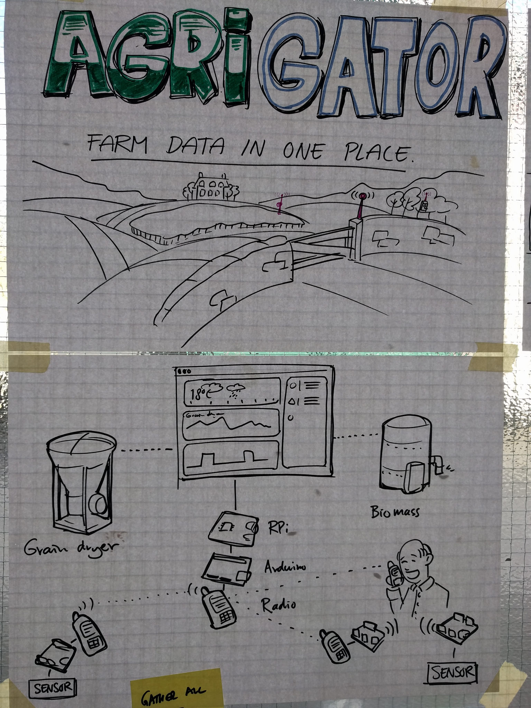

# Agrigator

### Agrigator is trying to combine in a self-hosted way different feeds from IOT connected machines and radio communication throughout a huge farm space. Low power/old technologies are juxtaposed with new ones in the aim to put the farmer in the middle of the conversation.

*By Davide and Harm*

Agrigator project is answering a well-known, common question: why all these different devices are offfering their very own UI/app/site/feed to send (and monitor) their Data? During the research process we were able to interact with an evolved, mature, tech-savvy approach to agriculture that favors direct interaction throught Data (i.e. grain dryier machine to humidity, bio-masses machine to wheather forecast, surveillance CCTV cameras to SMS and storing, etc) rather than a passive, layered visualisation on it on different platforms. 

The site is based on Emonpi, the rpi version of the UK-based EmonCMS project. Different protocols were set up in order to face the well-known communication problems a huge farm may face: DTMF (dual tone multi frequency) was our first choice to have the data possibly sent over one of the free channels the radio used by the farmers has, and this approach may be used to have a whole channel devoted to "physical feeds" within the farm.

The Dashboard of the platform should offer a visualization of the progress from industrial to organic agriculture and a possible social-shareable data for the farm to better storytell their efforts.

See also: [https://github.com/OfficineArduinoTorino/RuralHack](https://github.com/OfficineArduinoTorino/RuralHack)

